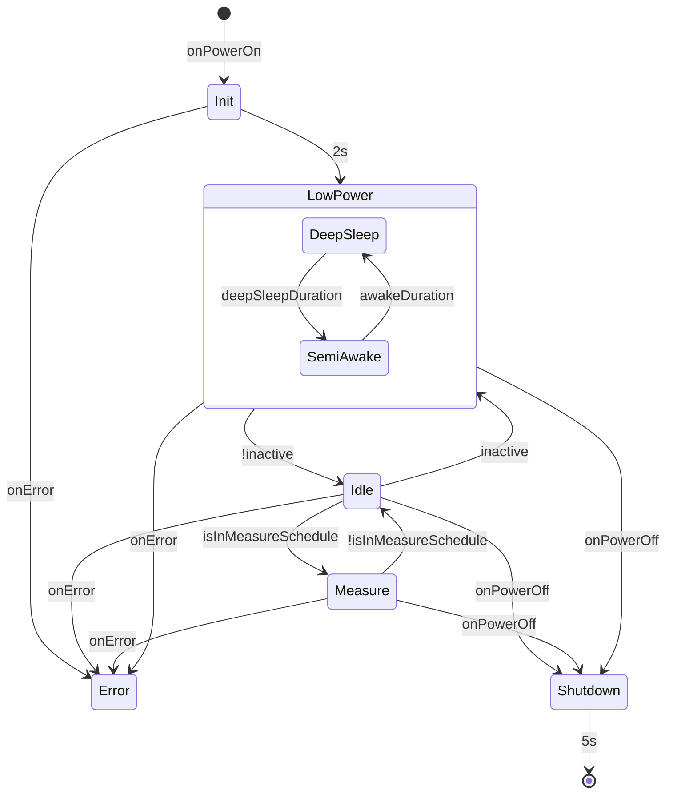

<show-structure for="chapter" depth="2"/>

# Acquisition

The Acquisition module is the device that is used to measure micro-strains from mining operations.

It is also known as the Doorstopper, as it was the initial scope of the project which then lead to multiple modules.

## Configuration

The device configuration is stored inside the `config.ini` file.

If the file is missing, a default one is created with the following content

```Ini
[Application]
name            = Doorstopper # Name of the device, up to 16 characters
logLevel        = error       # Set maximum log level: none, error, warning, info, debug, all

[LowPower]
wakeDuration    = 100         # Duration in ms before the device switch back from semi-awake to sleep state
autoSleep       = 300         # Duration in s before a device in idle mode switch to low-power mode
autoPowerOff    = 3600        # Duration in s before a device will automatically power-off when not doing anything

[Measure]
osr             = 15          # 1: 64, 2: 128, 3: 256, 4: 512, 5: 1024, 6: 2048, 7: 4096, 8: 8192, 9: 16384, 15: 32768
meanWidth       = 1           # number of sample to use for the moving average
thermistor      = 1           # kind of thermistor used by the probe

[LoRa]
address         = 00000000    # 8-digit hex number representing the LoRa address of the device. Must be unique.
bandwith        = 8           # 0: 7.8KHz, 1: 10.4KHz, 2: 15.6KHz, 3: 20.8KHz, 4: 41.7KHz, 5: 62.5KHz, 6: 125KHz, 7: 250KHz, 8: 500KHz 
codingRate      = 1           # 1: 4/5, 2: 4/6, 3: 4/7, 4: 4/8
spreadingFactor = 7           # 6 to 12, the lower the faster, the higher the further 
hopPeriod       = 32          # number of symbols between each Frequency Hop, 0 disable it, [0 - 255]
```

> The address field allows the interface to differentiate devices over LoRa.
> The default value will be generated based on the MCU unique address but there is no
> guarantee that the result will be unique.
> Make sure that each of your acquisition module have a different address
> {style="warning"}

## Modes

This device oscillate between 3 different modes: [LowPower](#low-power), [Idle](#idle) and [Measure](#measure)



`inactive` is triggered when:

- The device is not plugged from its power source,
- AND, it has not received a message for the duration `wakeDuration`,
- AND, it has no scheduled measures.

`isInMeasureSchedule` is valid when:

```tex
start <= systick < start + duration
```

Where start and duration are the members time and duration of the schedule measure.
See [MeasureSchedule](structures.md#measureschedule).

`onPowerOn` is triggered when:

- User pressed the power button and the device was off,
- OR device was plugged in.

`onPowerOff` is triggered when:

- User pressed the power button when the device was on AND the device is not plugged in,
- OR device received a shutdown command from LoRa AND the device is not plugged in,
- OR device reached `autoPowerOff` duration AND the device is not plugged in.

### Init

Allows to prepare the device

### Low power

In order to save power, the device can switch to low power mode. The device will then oscillate between a deep sleep
state and semi-awake state.

#### Deep sleep

When in this mode, the device goes
into [STOP_MODE](https://wiki.st.com/stm32mcu/wiki/Getting_started_with_PWR#Stop0-2C_Stop1-2C_and_Stop2_modes). This
allows to stop the software by switching off the High-Speed clocks, and to switch off most of the peripherals.
While not being the best mode for the lowest-current usage, this is the only one we can use as we need to keep the GPIO
active in order to keep the STAY_ON pin active and not definitely shut ourselves off.

Each seconds, the RTC of the STM will trigger an event that will switch the device from Deep-Sleep to Semi-Awake.
It is currently not possible to change the duration of the Deep-Sleep state.

[//]: # (Actually possible, but is dependent on the timer configuration. I'm a bit too lazy to change that.)

[//]: # (If implemented, we can use a deepSleepDuration field)

#### Semi-Awake

- check if the device is plugged-in,
- pass the lora in receive mode.

If the device is plugged-in, it must pass to the [Idle mode](#idle). It can also leave this mode by receiving
a [Wake-Up](#wake-up) command.

After a set time, the device automatically goes back to Deep-Sleep state. This duration can be configured with the
configuration field **wakeDuration** from the **LowPower** section.

### Idle

This mode is meant for allowing the user to communicate with the module without waiting.
In this mode, the LoRa is constantly in receive mode and the CAN is turned on.
If plugged, the device cannot fall back into Low Power mode.
In this mode, the device must periodically measure the IMU, temperature and battery voltage.

### Measure

When in measure mode, the device must record each second a sample from its sensors: gauge, IMU, temperature.
The Receiver stays on so that the user can still submit commands, but it is greatly discouraged doing so unless if for
stopping the measure.

### Error

Device fall in Error mode when an irrecoverable error arise.

When in this mode, the LED must blink at 4Hz and the user must be able to fetch the error status.

## Powered-on Interfaces

| Mode     | SubMode    | Probe                          | CAN                | LoRa     | IMU                  |
|----------|------------|--------------------------------|--------------------|----------|----------------------|
| Init     | None       | Disabled                       | Disabled           | Disabled | Disabled             |
| LowPower | Deep sleep | Disabled                       | Disabled           | Disabled | Disabled             | 
| LowPower | Semi Awake | Brief power on for temperature | Disabled           | RX       | Single acquisition   | 
| Idle     | None       | Brief power on for temperature | Enabled if plugged | RX       | Periodic acquisition |
| Measure  | None       | Enabled                        | Enabled if plugged | RX       | Periodic acquisition |
| Shutdown | None       | Disabled                       | Enabled if plugged | RX       | Disabled             |

## Status LED

Depending on the mode, the Status LED must carry information allowing the user to know by a glance in what mode the
module is.

| Mode     | SubMode      | pattern                      |
|----------|--------------|------------------------------|
| Init     | None         | Stays on                     |
| LowPower | Deep sleep   | Stays off                    |
| LowPower | SemiAwake    | On for 100ms on entrance     |
| Idle     | Not charging | On for 100ms every 3 seconds |
| Idle     | Charging     | On for 500ms every second    |
| Idle     | Charged      | On for 900ms every second    |
| Measure  | None         | On for 100ms every second    |
| Error    | None         | Blink at 4Hz                 |
| Shutdown | None         | Stays on                     |

## Measures

Depending on the mode, the device must periodically run a measurement on its sensors.

| Mode      | SubMode    | Sensors                          | Frequency |
|-----------|------------|----------------------------------|-----------|
| Init      | None       | None                             | None      |
| Low Power | Deep sleep | None                             | None      |
| Low Power | Semi Awake | Battery, Temperature, IMU        | Once      |
| Idle      | None       | Battery, Temperature, IMU        | 1Hz       |
| Measure   | None       | Battery, Temperature, IMU, Gauge | 1Hz       |
| Error     | None       | Battery, Temperature, IMU        | 1Hz       |
| Shutdown  | None       | None                             | None      |

### Battery

In order to measure the battery state, we must measure the /CHRG, /ACP and VBAT_FB pins. /CHRG and /ACP are discrete
signals while VBAT_FB must be measure with the internal ADC.

| /CHRG | /ACP | State     |
|-------|------|-----------| 
| LOW   | LOW  | Charging  | 
| LOW   | HIGH | Error     | 
| HIGH  | LOW  | Charged   |
| HIGH  | HIGH | Discharge |

### Temperature

The temperature is measured both by the internal temperature sensor and the thermistor next to the probe connector.
In order to measure the thermistor, the probe must be connected and the powered-on.

The thermistor properties is ???.

## Commands

| #  | Name                       | Description                              |
|----|----------------------------|:-----------------------------------------|
| 1  | Get version                | Return current version                   |
| 2  | Get kind                   | Return device kind                       |
| 3  | Get post                   | Return the post result                   |
| 4  | Get time                   | Return the current time                  |
| 5  | Set time                   | Set the current time                     | 
| 6  | Get configuration field    | Return a configuration field             |
| 7  | Set configuration field    | Set a configuration field                |
| 8  | Get probe connection state | Get the probe connection state           | 
| 9  | Get battery state          | return the battery state                 |
| 10 | Get temperature            | Return the last temperature measured     |
| 11 | Get IMU                    | Return the last IMU measured             |
| 12 | Set IMU                    | Reset the IMU reference to current value |
| 13 | Start single measurement   | Run a single measurement                 |
| 14 | Get last sample            | Return the last sample                   |
| 15 | Sleep                      | Switch from idle to sleep mode           | 
| 16 | Wake up                    | Switch from sleep to idle mode           | 
| 17 | Shutdown                   | Shutdown the device                      |
| 18 | Get measure schedule       | Return the next schedule measure         |
| 19 | Set measure schedule       | Schedule a measure                       |
| 20 | Get measure result         | Fetch the last measure result            |
| 21 | Calibrate                  | Calibrate the sensor                     |
| 22 | Get calibration            | Get last calibration value               |
| 23 | Restart                    | Request the device to restart            |
| 24 | Error                      | Returned when command failed             |

---

### Get Version {id="get-version"}

Request acquisition module version

#### Parameters {id="get-version-parameters"}

none

#### Returns {id="get-version-returns"}

- version: [Version](structures.md#version).

---

### GetKind

#### Parameters {id="get-kind-parameters"}

None

#### Returns {id="get-kind-returns"}

- kind: [DeviceKind](enumerations.md#devicekind), always Acquisition.

---

### Get Post

Request the post report

#### Parameters {id="get-post-parameters"}

None

#### Returns {id="get-post-returns"}

- post: [AcquisitionPost](structures.md#acquisitionpost).

---

### Get Time {id="get-time"}

Get the MCU systick

#### Parameters {id="get-time-parameters"}

None

#### Returns {id="get-time-returns"}

- time: [Time](alias.md#time).

---

### Set Time {id="set-time"}

Set the MCU systick

#### Parameters {id="set-time-parameters"}

- time: [Time](alias.md#time).

#### Returns {id="set-time-returns"}

- time: [Time](alias.md#time).

---

### Get Configuration Field {id="get-configuration-field"}

Fetch a field from the configuration.

#### Parameters {id="get-configuration-field-parameters"}

- section: String,
- name: String.

#### Returns {id="get-configuration-field-returns"}

- section: String,
- name: String,
- value: String, empty if non-existent.

---

### Set Configuration Field {id="set-configuration-field"}

Set a field to the configuration.

If the value is empty, the field will be removed from the configuration.

If there is no field inside a section, it will be removed from the configuration.

#### Parameters {id="set-configuration-field-parameters"}

- section : String,
- name: String,
- value: String.

#### Returns {id="set-configuration-field-returns"}

- section: String,
- name: String,
- value: String.

---

### Get Probe Connection State

Tell if a probe is connected to the acquisition module.

#### Parameters {id="get-probe-connection-state-parameters"}

None

#### Returns {id="get-probe-connection-state-returns"}

- state: [ProbeConnectionState](enumerations.md#probeconnectionstate).

---

### Get Battery State {id="get-battery-state"}

Get the last known battery state.

#### Parameters {id="get-battery-state-parameters"}

None

#### Returns {id="get-battery-state-returns"}

- voltage: float, last measure voltage,
- acs: bool, true if module is plugged,
- charge: bool, true if module is charging.

---

### Get Temperature

Get the last measured temperature.

#### Parameters {id="get-temperature-parameters"}

None

#### Returns {id="get-temperature-returns"}

- internal: i16, MCU internal temperature in Celsius,
- thermistor: u32, raw probe thermistor value.

---

### Get IMU

Get the last measured IMU.

#### Parameters {id="get-imu-parameters"}

None

#### Returns {id="get-imu-returns"}

- orientation: [Orientation](structures.md#orientation).

---

### Set IMU

Reset the IMU reference to current value.
Returns the orientation which should be 0,0,0.

#### Parameters {id="set-imu-parameters"}

None

#### Returns {id="set-imu-returns"}

- orientation: [Orientation](structures.md#orientation)

---

### Start single measurement

Trigger a single complete measurement of all sensor on the MCU.
Return the current time in order to check if last sample is valid.

#### Parameters {id="start-single-measurement-parameters"}

None

#### Returns {id="start-single-measurement-returns"}

- time: [Time](alias.md#time), time when the measure as been accepted.

---

### Get last Sample

Fetch last acquisition measure sample.

Sample is updated when in measure mode or after requesting a single measurement.

#### Parameters {id="get-last-sample-parameters"}

None

#### Returns {id="get-last-sample-returns"}

- sample: [AcquisitionMeasureSample](structures.md#acquisitionmeasuresample)

---

### Sleep {id="sleep"}

Switch from idle to sleep mode.
By default, the device will automatically switch after a delay set by the configuration.
This command allows switching to it immediately.

#### Parameters {id="sleep-parameters"}

None

#### Returns {id="sleep-returns"}

- mode: [AcquisitionMode](enumerations.md#acquisitionmode).

--- 

### Wake Up {id="wake-up"}

Switch from sleep to idle mode.

#### Parameters {id="wake-up-parameters"}

None

#### Returns {id="wake-up-returns"}

- mode: [AcquisitionMode](enumerations.md#acquisitionmode).

--- 

### Shutdown

Switch to shut down.

#### Parameters {id="shutdown-parameters"}

None

#### Returns {id="shutdown-returns"}

- mode: [AcquisitionMode](enumerations.md#acquisitionmode).

---

### Get Measure Schedule {id="get-measure-schedule"}

Request the current measure schedule.

#### Parameters {id="get-measure-schedule-parameters"}

None

#### Returns {id="get-measure-schedule-returns"}

- schedule: [MeasureSchedule](structures.md#measureschedule).

---

### Set Measure Schedule {id="set-measure-schedule"}

Schedule the next measurements.

If schedule time is 0, will cancel the current measurement.

#### Parameters {id="set-measure-schedule-parameters"}

- schedule: [MeasureSchedule](structures.md#measureschedule).

#### Returns {id="set-measure-schedule-returns"}

- schedule: [MeasureSchedule](structures.md#measureschedule).

---

### Get Measure Result

Will fetch the last measure samples.

#### Parameters {id="get-measure-result-parameters"}

- start: u16, index of the first sample,
- length: u16, maximum number of samples to return.

#### Returns {id="get-measure-result-returns"}

- start: u16, index of the first sample,
- length: u16, number of samples in this chunk,
- total: u16, total number of samples available,
- samples: Array([Acquisition Measure Samples](structures.md#acquisitionmeasuresample)).

---

### Calibrate {id="calibrate"}

Trigger a calibration of the sensors.

Return time allowing to tell if receive calibration is valid.

#### Parameters {id="calibrate-parameters"}

None

#### Returns {id="calibrate-returns"}

- time: [Time](alias.md#time), time when the request was accepted.

---

### Get Calibration {id="get-calibration"}

Fetch the last calibration results

#### Parameters {id="get-calibration-parameters"}

None

#### Returns {id="get-calibration-returns"}

- calibration: [AcquisitionCalibration](structures.md#acquisitioncalibration).

---

### Restart

Request the device to restart.

Restart is not immediate, allowing the device to reply.

#### Parameters {id="restart-parameters"}

None

#### Returns {id="restart-returns"}

None

---

### Error {id="error-command"}

Returned from acquisition module when a command has failed.

#### Parameters {id="error-command-parameters"}

None

#### Returns {id="error-command-returns"}

- id: u8, the ID of the command that failed
- code: [Error](enumerations.md#error).
