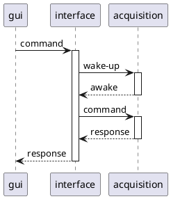

<show-structure for="chapter" depth="2"/>

# Interface

The interface module serves as the interface between the [Acquisition](acquisition-module.md) module and the GUI

## Commands

| # | Name                     | Connection | Description                                         | 
|---|--------------------------|------------|-----------------------------------------------------|
| 1 | Get Version              | false      | Get bridge current version                          |
|   | Get Medium Configuration | false      | Return the currently selected medium                |
|   | Set Medium Configuration | false      | Set what medium to use                              |
|   | Get Acquisition State    | true       | Request the current state to the acquisition module |
|   | Start Measure            | true       | Start a measure                                     |
|   | Stop Measure             | true       | Cancel the current measure                          |
|   | Get Measure Progress     | true       |                                                     |
|   | Get Measure Result       | true       | Fetch a measure result                              |
|   | Send Command             | true       | Send directly a command to the acquisition module   |

When using LoRa, and for each command that requires a connection with the acquisition module, a wake-up command is
issued
first in order to make sure that the device is awake. If the device does not wake up, the command fails.
This wake-up call applies for: [Get Acquisition State](#get-acquisition-state), [Start Measure](#start-measure), [Stop
Measure](#stop-measure), [Get Measure Progress](#get-measure-progress), [Send Command](#send-command)

### Get version

Return the firmware version of the module.

#### Parameters {id="get-version-parameters"}

None

#### Returns {id="get-version-returns"}

- version: [Version](structures.md#version)

### Get Medium Configuration

Fetch the current medium configuration of the module.
If not connected, the medium field in configuration will have the Unknown value (0).

#### Parameters {id="get-medium-configuration-parameters"}

None

#### Returns {id="get-medium-configuration-returns"}

- configuration: [MediumConfiguration](structures.md#mediumconfiguration).

### Set Medium Configuration

Change module medium configuration.

#### Parameters {id="set-medium-configuration-parameters"}

- configuration: [MediumConfiguration](structures.md#mediumconfiguration).

#### Returns {id="set-medium-configuration-returns"}

- configuration: [MediumConfiguration](structures.md#mediumconfiguration).

### Get Acquisition State

Fetch the connected acquisition module state.

#### Parameters {id="get-acquisition-state-parameters"}

None

#### Returns {id="get-acquisition-state-returns"}

None

### Start Measure

Trigger a new measurements.
This will synchronize both modules then schedule a measure in the next 5 seconds.
Will invalidate the last result if the measure starts.

#### Parameters {id="start-measure-parameters"}

- duration: [Duration](alias.md#duration), the duration of the measure.

#### Returns {id="start-measure-returns"}

- schedule: [MeasureSchedule](structures.md#measureschedule), the schedule of the measure.

### Stop Measure

Stop or cancel a measurements.
Does not invalidate the results.

#### Parameters {id="stop-measure-parameters"}

None

#### Returns {id="stop-measure-returns"}

None

### Get Measure Progress

#### Parameters {id="get-measure-progress-parameters"}

None

#### Returns {id="get-measure-progress-returns"}

- schedule: [MeasureSchedule](structures.md#measureschedule),
- sample: [InterfaceSamples](structures.md#interfacemeasuresample), last sample from interface,
- time: [Time](alias.md#time), current time for the interface.

### Get Measure Result

Fetch results samples from either the Interface or acquisition modules.

#### Parameters {id="get-measure-result-parameters"}

- device: [DeviceKind](enumerations.md#devicekind)
- start: u32, start index for this chunk,
- length: u32, max number of sample to returns in this message.

#### Returns {id="get-measure-result-returns"}

- device: [DeviceKind](enumerations.md#devicekind)
- start: u32, start index for the chunk,
- length: u32, number of samples returned in this message,
- total: u32, number of samples recorded in last acquisition,
- samples: [Interface samples](structures.md#interfacemeasuresample), if device is
  Interface, [Acquisition samples](structures.md#acquisitionmeasuresample)

### Send Command

#### Parameters {id="send-command-parameters"}

- address: String,

#### Returns {id="send-command-returns"}

None