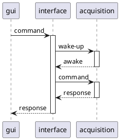

<show-structure for="chapter" depth="2"/>

# Interface

The interface module serves as the interface between the [Acquisition](acquisition-module.md) module and the GUI

## Commands

| #  | Name                            | Connection | Description                                        | 
|----|---------------------------------|------------|----------------------------------------------------|
| 1  | Get Version                     | false      | Get bridge current version                         |
| 2  | Get Kind                        | false      | Get device kind                                    | 
| 3  | Get Medium Configuration        | false      | Return the currently selected medium               |
| 4  | Set Medium Configuration        | false      | Set what medium to use                             |
| 5  | Get Acquisition Mode            | true       | Request the current mode to the acquisition module |
| 6  | Start Measure                   | true       | Start a measure                                    |
| 7  | Stop Measure                    | true       | Cancel the current measure                         |
| 8  | Get Measure Progress            | true       |                                                    |
| 9  | Get Interface Measure Results   | true       | Fetch interface measure results                    |
| 10 | Get Acquisition Measure Results | true       | Fetch Acquisition measure results                  |
| 11 | Send Command                    | true       | Send directly a command to the acquisition module  |
| 12 | Error                           | false      | Returned when command failed                       |

When using LoRa, and for each command that requires a connection with the acquisition module, a wake-up command is
issued
first in order to make sure that the device is awake. If the device does not wake up, the command fails.
This wake-up call applies for: [Get Acquisition Mode](#get-acquisition-mode), [Start Measure](#start-measure), [Stop
Measure](#stop-measure), [Get Measure Progress](#get-measure-progress), [Send Command](#send-command)

--- 

### Get version

Return the firmware version of the module.

#### Parameters {id="get-version-parameters"}

None

#### Returns {id="get-version-returns"}

- version: [Version](structures.md#version)

---

### Get Kind

#### Parameters {id="get-kind-parameters"}

None

#### Returns {id="get-kind-returns"}

- kind: [DeviceKind](enumerations.md#devicekind), always Interface.

---

### Get Medium Configuration

Fetch the current medium configuration of the module.
If not connected, the medium field in configuration will have the Unknown value (0).

#### Parameters {id="get-medium-configuration-parameters"}

None

#### Returns {id="get-medium-configuration-returns"}

- configuration: [MediumConfiguration](structures.md#mediumconfiguration).

---

### Set Medium Configuration

Change module medium configuration.

#### Parameters {id="set-medium-configuration-parameters"}

- configuration: [MediumConfiguration](structures.md#mediumconfiguration).

#### Returns {id="set-medium-configuration-returns"}

- configuration: [MediumConfiguration](structures.md#mediumconfiguration).

---

### Get Acquisition Mode

Fetch the connected acquisition module mode.

#### Parameters {id="get-acquisition-mode-parameters"}

None

#### Returns {id="get-acquisition-mode-returns"}

- mode: [AcquisitionMode](enumerations.md#acquisitionmode)

---

### Start Measure

Trigger a new measurements.
This will synchronize both modules then schedule a measure in the next 15 seconds.

#### Parameters {id="start-measure-parameters"}

- duration: [Duration](alias.md#duration), the duration of the measure.

#### Returns {id="start-measure-returns"}

- schedule: [MeasureSchedule](structures.md#measureschedule), the schedule of the measure.

---

### Stop Measure

Stop or cancel a measurements.
Does not invalidate the results.

#### Parameters {id="stop-measure-parameters"}

None

#### Returns {id="stop-measure-returns"}

- schedule: [MeasureSchedule](structures.md#measureschedule).

---

### Get Measure Progress

Request a progression report from the interface.

#### Parameters {id="get-measure-progress-parameters"}

None

#### Returns {id="get-measure-progress-returns"}

- schedule: [MeasureSchedule](structures.md#measureschedule),
- sample: [InterfaceSamples](structures.md#interfacemeasuresample), last sample from interface,
- time: [Time](alias.md#time), current time for the interface.

---

### Get Interface Measure Result

Fetch results samples from interface module.

#### Parameters {id="get-interface-measure-result-parameters"}

- start: u32, start index for this chunk,
- length: u32, max number of sample to returns in this message.

#### Returns {id="get-interface-measure-result-returns"}

- start: u32, start index for the chunk,
- length: u32, number of samples returned in this message,
- total: u32, number of samples recorded in last acquisition,
- samples: [Interface samples](structures.md#interfacemeasuresample).

---

### Get Acquisition Measure Result

Fetch results samples from acquisition module.

#### Parameters {id="get-acquisition-measure-result-parameters"}

- start: u32, start index for this chunk,
- length: u32, max number of sample to returns in this message.

#### Returns {id="get-acquisition-measure-result-returns"}

- start: u32, start index for the chunk,
- length: u32, number of samples returned in this message,
- total: u32, number of samples recorded in last acquisition,
- samples: [Acquisition samples](structures.md#acquisitionmeasuresample).

---

### Send Command

Allows to directly send any commands to the acquisition module.

#### Parameters {id="send-command-parameters"}

- id: u8, command ID,
- payload: String, representation of an Array(u8) using HEX STRING.

#### Returns {id="send-command-returns"}

- id: u8, command ID,
- payload: String, representation of an Array(u8) using HEX STRING.

---

### Error {id="error-command"}

Returned from acquisition module when a command has failed.

#### Parameters {id="error-command-parameters"}

None

#### Returns {id="error-command-returns"}

- id: u8, the ID of the command that failed
- code: [Error](enumerations.md#error).