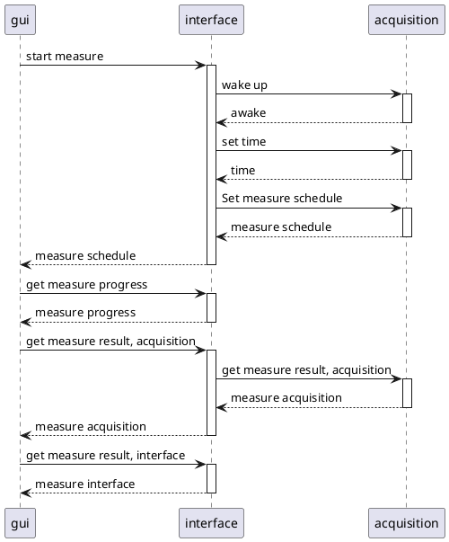

# Usage

This chapter showcase various use case of the modules.
To give better context of what is expected from the modules.

## Connection

This section explains how to connect the gui, interface and acquisition modules together.

The gui and interfaces module are connected together through a serial link.
It requires no protocol to enable the connection, the gui can directly select which serial port to use and can
immediately send any commands.

When the GUI is connected to the interfaces module, it will get the current medium configuration medium
using [Get Medium Configuration](interface-module.md#get-medium-configuration).
If the interface is already connected, it immediately shows the device menu, otherwise, it allows the user to change the
Communication Medium using [Set Medium Configuration](interface-module.md#set-medium-configuration)

## Low Power

When the acquisition module is in low power, it will wake up periodically awaiting a command on LoRa.
While it could receive any command in this state, most exchanges will fails due to the LoRa being powered on only 10% of
the time.
It is then recommended to only use the [Wake-up](acquisition-module.md#wake-up) command and spam it until the module
reply.

## Measure

A measurement is the action to trigger a measure from the GUI to both the interface and acquisition module.  
The acquisition module measure the micro-strains from 4 gauge, the temperature and the orientation of the module.  
The interface module measure the drill depth.

In order to synchronize both modules, we use [set time](acquisition-module.md#set-time).
It allows the interface to set the acquisition module systick.
> Expect a difference on the systick between Interface and Acquisition modules due to the medium propagation, especially
> for the LoRa.
> {style="warning"}

### Schedule a measure

The user can trigger a new measurements using the [Start Measure](interface-module.md#start-measure) command.

The interface starts by making sure that the device is awake, using the [wake-up](acquisition-module.md#wake-up) command
Then, it uses [Set Time](acquisition-module.md#set-time) in order to synchronise both module.
Finally, it uses [Set Schedule Measure](acquisition-module.md#set-measure-schedule).
For each of these steps, if no response was given, the procedure ends and reports an error.

If the user wants to cancel a measure, it can use the [Stop Measure](interface-module.md#stop-measure) commands.
The interface will then schedule a new MeasureSchedule with a time of 0. Doing so does not invalidate current measure,
which means it is safe to cancel a measure and read it results.

[MeasureSchedule](structures.md#measureschedule) are used in order to avoid LoRa messages misses. Since both modules
must be synced together, and LoRa messages might miss, just sending a start command might end up starting the
measurement on the acquisition module without the interface.
Using schedule measurements allows both device to check that they are synced before running a measurement.

### During a measurements

A measurement starts the device systick enter the ScheduleMeasurements time schedule. Due to measurements requiring more
space than the device RAM, samples must be stored onto their SD cards. They also keep their most recent sample in their
RAM memory, allowing the GUI to fetch it when getting measurement progress.

When the device enter a measurement schedule, it must close its result file if it is still opened and reopen it in write
mode, invalidating the previous result.

The GUI can use [Get Measure Progress](interface-module.md#get-measure-progress) to fetch the measure progress from the
interface card. It can also use [Get last measure](acquisition-module.md#get-last-measure) to get the last measure sample from 

Once the measure is done, the result file must be flushed and closed.

### Get Measure Result

The interface
expose [Get Measure Result](interface-module.md#get-measure-progress) which allows getting results from both the
interface and the acquisition modules. When fetching a result, it is expected to have the following behavior for both
device:

The last chunk must be kept in memory in case the device request it again due to an error.

The result file must be opened and closed automatically. If the start index is 0 and the file is closed, the file must
be opened in read mode. When the last chunk of the result has been loaded, the file must be closed. If the start index
is 0 and the force is enabled, the file must be reopened in read. If a measure starts and the file is opened, the file
must be closed.

